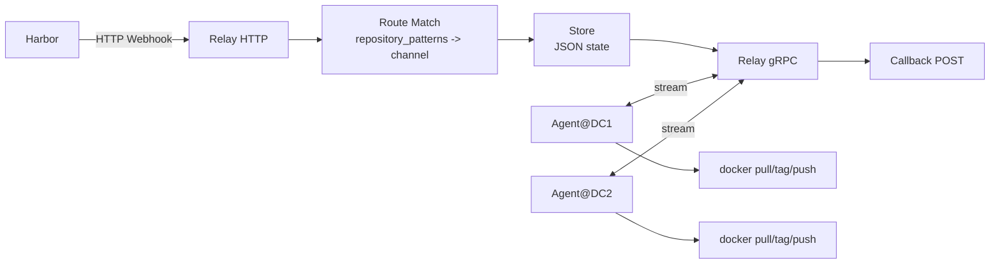

# Harbor Relay 架构说明

这份文档重点解释三件事：

1. Harbor 的 HTTP webhook 是怎么变成内部任务的
2. 内部任务又是怎么通过 gRPC 发给远端 agent 的
3. 为什么这里要设计 `channel`

## 整体结构

## 为什么不是直接 Harbor -> 远端

因为你的真实场景不是“一推就同步到一个地方”，而是：

- 一个 Harbor 承接多个项目
- 一个 relay 面向多个远端 DC
- 不同 DC 只关心部分仓库
- 后面还要能继续扩展不同业务频道

所以 relay 不是简单转发器，而是“任务中心”。

## HTTP webhook 怎么变成内部任务

入口代码在：

- [internal/relay/service.go](./internal/relay/service.go)

主流程是：

1. 按 `path` 找到对应 webhook 配置
2. 校验 `Authorization`
3. 解析 Harbor payload
4. 取出 `repository + digest + tags`
5. 按 `repository_patterns` 找 route
6. route 决定 `channel`
7. route 决定 `target_sites`
8. 为每个 `site + digest` 生成任务
9. 把任务落到 store

这一步结束之后，HTTP 的职责就完成了。

## 为什么要设计 channel

`channel` 的核心价值是“把业务路由和消费调度分开”。

你可以这样理解：

- `repository_patterns`
  - 业务范围
- `channel`
  - 调度分组
- `target_sites`
  - 哪些站点消费这个分组

比如：

- `kube4/mysql` -> `db-core`
- `kube4/redis*` -> `db-core`
- `milvus/**` -> `ai-platform`

然后 DC1 可以只订阅：

- `db-core`

DC2 可以订阅：

- `db-core`
- `ai-platform`

这样以后加项目、加 DC、加业务线，都主要是改配置，不用推翻代码。

## gRPC 在这里负责什么

入口代码在：

- [internal/relay/grpc.go](./internal/relay/grpc.go)
- [internal/agent/agent.go](./internal/agent/agent.go)

它不是拿来接 Harbor 的，而是拿来接远端 agent 的。

原因是 agent 和 relay 的关系不是一次性请求，而是：

- agent 要长期在线
- agent 要发心跳
- relay 要随时派发任务
- agent 要持续上报进度

所以这里用双向流 gRPC 很合适。

## 任务是怎么被派发的

核心代码在：

- [internal/relay/store.go](./internal/relay/store.go)

调度条件非常明确：

1. `task.SiteName == agent.SiteName`
2. `task.Channel` 被 `agent.Channels` 订阅
3. `task.Status == PENDING`

只有满足这三个条件，任务才会发给这个 agent。

## 为什么当前先用 JSON store

因为交付项目第一阶段，优先级通常是：

- 透明
- 好排障
- 依赖少

JSON 文件的优点是：

- 不额外引入数据库
- ssh 上去可以直接看
- 很容易备份

缺点也很明确：

- 高并发一般
- 不适合复杂查询

所以它适合当前阶段，但以后如果任务量显著变大，可以再换 SQLite 或 PostgreSQL。

## 这套架构最关键的一句话

HTTP webhook 不会“直接转成 gRPC”。

真正的链路是：

1. Harbor webhook 进入 `HandleWebhook`
2. webhook 被解析成内部任务
3. 任务落到 store
4. gRPC 长连接上的 agent 再按 `site + channel` 领取任务

也就是说：

- HTTP 负责“产出任务”
- gRPC 负责“消费任务”

这个边界就是这套架构稳定、可扩展的关键。
