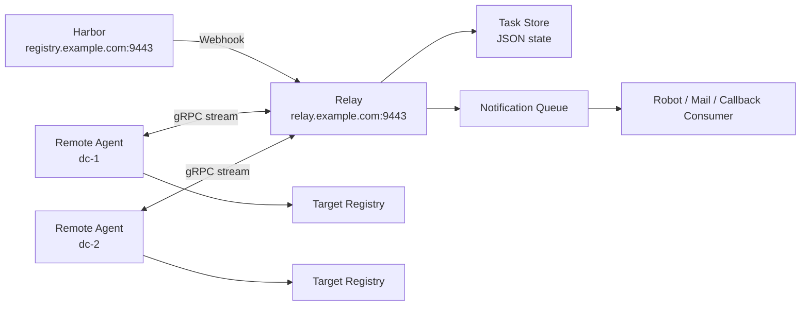

# Harbor Relay

`harbor-relay` is a lightweight control plane for cross-environment image distribution.

It connects the full chain below:

`Harbor Webhook -> Relay -> Remote Agent -> Target Registry -> Callback / Notification`

The project is designed for environments where one Harbor serves multiple projects, multiple target sites, and multiple notification channels. The goal is to make image synchronization routable, observable, auditable, and easy to operate.

## What It Solves

- One relay can accept multiple Harbor webhook paths.
- Repositories are routed to logical channels before being dispatched to sites.
- One site can subscribe only to the channels it should consume.
- Source and target registries may be the same Harbor with different robot accounts.
- Agents pull by digest and push by tag, while keeping human-readable descriptors such as `image:tag@sha256:...`.
- Built-in notification queue supports rate-limited robot gateways such as OneMsg.
- Relay and agent can be installed as `systemd` services through packaged `.run` installers.
- The documentation site is built with Docusaurus and can be exposed behind Caddy.

## Architecture



## Repository Layout

- `cmd/relay`
  - Relay service entrypoint
- `cmd/agent`
  - Remote agent entrypoint
- `internal/relay`
  - Webhook handling, routing, task store, gRPC service
- `internal/agent`
  - Docker-based pull/tag/push execution
- `internal/callback`
  - Outbound callback and notification delivery
- `configs/`
  - Public example configs for relay and agent
- `deploy/systemd/`
  - Service unit files
- `deploy/caddy/`
  - Example Caddy site configs
- `docs/`
  - Docusaurus-backed documentation source
- `website/`
  - Docusaurus app and static-site build assets

## Quick Start

### 1. Run tests

```bash
go test ./...
```

### 2. Build `.run` installers

Linux/macOS:

```bash
./build.sh --arch amd64
./build.sh --arch arm64
```

Windows PowerShell:

```powershell
.\build.ps1 -Arch amd64
.\build.ps1 -Arch arm64
```

Generated artifacts:

- `dist/linux-amd64/harbor-relay-toolkit-linux-amd64.run`
- `dist/linux-arm64/harbor-relay-toolkit-linux-arm64.run`

### 3. Install relay

```bash
sudo ./harbor-relay-toolkit-linux-amd64.run install --role relay
sudo vi /etc/harbor-relay/relay.yaml
sudo ./harbor-relay-toolkit-linux-amd64.run activate --role relay
```

### 4. Install agent

```bash
sudo ./harbor-relay-toolkit-linux-amd64.run install --role agent
sudo vi /etc/harbor-relay/agent.yaml
sudo ./harbor-relay-toolkit-linux-amd64.run activate --role agent
```

### 5. Check runtime status

```bash
sudo ./harbor-relay-toolkit-linux-amd64.run status --role all
curl http://127.0.0.1:18080/api/v1/tasks
curl http://127.0.0.1:18080/api/v1/agents
```

## Documentation

- [Wiki Home](./docs/README.md)
- [System Overview](./docs/01-system-overview.md)
- [User Guide](./docs/02-user-guide.md)
- [Ops Guide](./docs/03-ops-guide.md)
- [Notification and Callback](./docs/04-notification-and-callback.md)
- [Full Example](./docs/05-full-example.md)
- [API Reference](./docs/06-api-reference.md)
- [Troubleshooting](./docs/07-troubleshooting.md)

## Documentation Website

The project ships a Docusaurus site under [website](./website).

Local preview:

```bash
cd website
npm install
npm run start
```

Production build:

```bash
cd website
npm install
npm run build
```

The generated static site will be in `website/build/`.

You can expose it through Caddy with the example file in:

- [docs.example.com.9443.caddy](./deploy/caddy/docs.example.com.9443.caddy)

## Release and CI

GitHub Actions are expected to do three things:

- run Go tests and documentation build on every push / PR
- build `.run` installers for `amd64` and `arm64`
- publish release artifacts when a version tag is pushed

This repository keeps all runtime secrets out of version control. Example configs only contain placeholders such as:

- `registry.example.com:9443`
- `replace-with-relay-webhook-token`
- `replace-with-source-robot-password`

## Security Notes

- Do not commit real Harbor credentials.
- Do not commit real robot keys or callback tokens.
- Use dedicated Harbor robot accounts with minimum required permissions.
- Use separate source and target robot accounts when source and target projects differ.

## License

See [LICENSE](./LICENSE) if you add one in the public repository. If this repository is being prepared for open source release, add the license before publishing.
