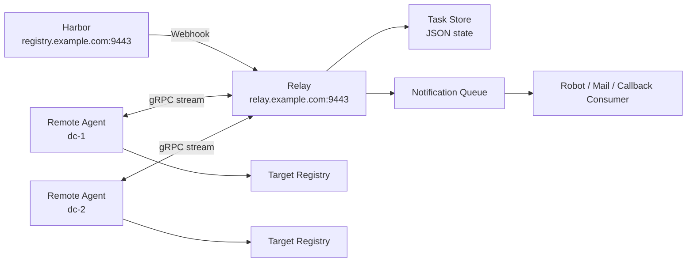

# Harbor Relay

`harbor-relay` 是一套面向交付场景和多环境运维场景的镜像同步控制面。

它把下面这条链路串了起来：

`Harbor Webhook -> Relay -> Remote Agent -> Target Registry -> Callback / Notification`

适用场景：

- 一个 Harbor 要服务多个项目
- 一个项目的镜像需要同步到多个远端站点
- 源仓库和目标仓库可能是同一个 Harbor，也可能是不同仓库
- 同步完成后需要回调运维平台、状态页、群机器人或邮件系统
- 需要使用 `.run` 安装包和 `systemd` 做标准化交付

## 核心能力

- 一个 relay 可承接多个 Harbor webhook path
- repository 先路由到逻辑 `channel`，再派发到具体 `site_name`
- 一个 site 只消费自己订阅的频道
- 支持源仓库和目标仓库使用不同账号
- agent 按 `digest` 拉取、按 `tag` 推送，同时保留 `image:tag@sha256:...` 这类可读描述
- 内置通知队列，支持 OneMsg 这类带频控限制的机器人网关
- callback 和 notification 可独立开启或关闭
- relay / agent 可通过 `.run` 安装包直接安装为 `systemd` 服务
- 文档站基于 Docusaurus，可直接挂到 Caddy 后面

## 架构概览



## 仓库结构

- `cmd/relay`
  - relay 服务入口
- `cmd/agent`
  - remote agent 服务入口
- `internal/relay`
  - webhook 处理、路由、任务存储、gRPC 服务
- `internal/agent`
  - Docker 拉取、打 tag、推送执行链路
- `internal/callback`
  - callback 与 notification 出站投递
- `configs/`
  - 公共示例配置和场景模板
- `deploy/systemd/`
  - systemd unit 文件
- `deploy/caddy/`
  - Caddy 配置示例
- `docs/`
  - Docusaurus 文档源文件
- `website/`
  - Docusaurus 站点工程

## 快速开始

### 1. 运行测试

```bash
go test ./...
```

### 2. 构建 `.run` 安装包

Linux / macOS:

```bash
./build.sh --arch amd64
./build.sh --arch arm64
```

Windows PowerShell:

```powershell
.\build.ps1 -Arch amd64
.\build.ps1 -Arch arm64
```

生成产物：

- `dist/linux-amd64/harbor-relay-toolkit-linux-amd64.run`
- `dist/linux-arm64/harbor-relay-toolkit-linux-arm64.run`

### 3. 安装 relay

```bash
sudo ./harbor-relay-toolkit-linux-amd64.run install --role relay
sudo vi /etc/harbor-relay/relay.yaml
sudo ./harbor-relay-toolkit-linux-amd64.run activate --role relay
```

### 4. 安装 agent

```bash
sudo ./harbor-relay-toolkit-linux-amd64.run install --role agent
sudo vi /etc/harbor-relay/agent.yaml
sudo ./harbor-relay-toolkit-linux-amd64.run activate --role agent
```

### 5. 查看运行状态

```bash
sudo ./harbor-relay-toolkit-linux-amd64.run status --role all
curl http://127.0.0.1:18080/api/v1/tasks
curl http://127.0.0.1:18080/api/v1/agents
```

## 文档导航

- [Wiki 首页](./docs/README.md)
- [系统架构说明](./docs/01-system-overview.md)
- [用户使用手册](./docs/02-user-guide.md)
- [运维部署手册](./docs/03-ops-guide.md)
- [通知与回调设计](./docs/04-notification-and-callback.md)
- [全流程示例](./docs/05-full-example.md)
- [接口说明](./docs/06-api-reference.md)
- [排障手册](./docs/07-troubleshooting.md)

## 文档站

项目自带 Docusaurus 站点工程，目录在 [website](./website)。

本地预览：

```bash
cd website
npm install
npm run start
```

生产构建：

```bash
cd website
npm install
npm run build
```

静态产物在：

- `website/build/`

通过 Caddy 暴露文档站，可参考：

- [docs.example.com.9443.caddy](./deploy/caddy/docs.example.com.9443.caddy)

## 发布与 CI

GitHub Actions 默认负责三件事：

- 每次 push / PR 执行 Go 测试和文档构建
- 构建 `amd64` 和 `arm64` 的 `.run` 安装包
- 打 tag 后发布 release 产物

## 安全建议

- 不要提交真实 Harbor 凭据
- 不要提交真实机器人 key 和 callback token
- 源仓库和目标仓库应使用最小权限账号
- 如果源项目和目标项目不同，建议使用不同的 robot 账号

## 许可证

如果要公开发布仓库，请在发布前补充 `LICENSE` 文件。
