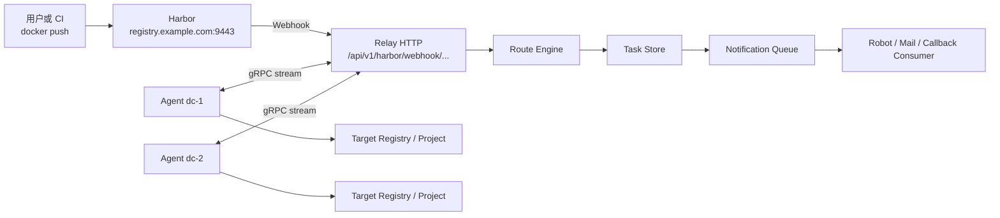

# 系统架构说明

`harbor-relay` 解决的是“源 Harbor 推送成功之后，如何把同一份镜像稳定、可观测地分发到多个远端环境”的问题。

## 总体链路



## 关键组件

### Harbor

Harbor 负责：

- 承接用户 `docker push`
- 保存源项目镜像
- 在镜像推送后向 relay 发送 webhook

Harbor 不负责任务编排，也不直接负责远端镜像同步。

### Relay

Relay 负责：

- 接收 Harbor webhook
- 解析 repository、tag、digest
- 将 repository 映射到 channel
- 将 channel 映射到一个或多个 `site_name`
- 创建同步任务
- 通过 gRPC 把任务分发给 agent
- 接收 agent 进度回报
- 发送 callback 与通知

### Agent

Agent 是远端执行器，只做确定性的镜像搬运：

1. 登录源仓库
2. 按 digest 拉取镜像
3. 登录目标仓库
4. 打目标 tag
5. 推送到目标项目
6. 回报进度和结果

Agent 不做调度决策，这样远端逻辑更简单，也更容易排障。

## 三个最重要的建模概念

### webhook path

`webhook path` 是入口边界，用来区分：

- 哪个 Harbor 项目或业务线在发事件
- 使用哪个 Authorization 头
- 默认应该用哪个 `source_registry`

例如：

```yaml
webhooks:
  - name: team-a
    path: /api/v1/harbor/webhook/team-a
```

### channel

`channel` 是调度边界。

它不一定等于 Harbor 项目名，而是 relay 内部的逻辑分组。一个 channel 可以对应：

- 一个业务线
- 一个环境域
- 一个同步策略

例如：

```yaml
routes:
  - name: team-a
    channel: team-a
    repository_patterns:
      - "team-a/**"
```

### site_name

`site_name` 是站点边界，用来决定任务最终发给哪个远端环境。

例如：

```yaml
targets:
  - name: dc1
    site_name: dc1
```

agent 只有在自己的 `site_name` 与任务匹配时，才会消费该任务。

## 为什么 source pull 要按 digest

系统实际拉取的是：

```text
registry.example.com:9443/team-a/my-app@sha256:...
```

原因是：

- `tag` 可变
- `digest` 唯一且稳定
- 可以确保远端拿到的正是 Harbor webhook 对应的那一份镜像内容

同时，系统仍然保留更易读的描述符：

- `image:tag`
- `image:tag@sha256:...`

这样既兼顾稳定性，也兼顾可读性。

## 为什么 callback 不直接等于 webhook

`webhook` 是 Harbor 发给 relay 的入站事件。  
`callback` 是 relay 在任务完成后发给外部系统的出站事件。

它们职责不同：

- webhook 表示“源 Harbor 有新镜像推送了”
- callback 表示“远端同步结果出来了”

## 推荐的对外入口规划

如果你已经在同一台机器上用 Caddy 暴露 Harbor 和 relay，推荐这样分：

- `registry.example.com:9443`
  - Harbor
- `relay.example.com:9443`
  - relay webhook、API、gRPC
- `docs.example.com:9443`
  - 文档站点

这样可以统一走一个外部 TLS 网关，同时按域名隔离不同服务。
