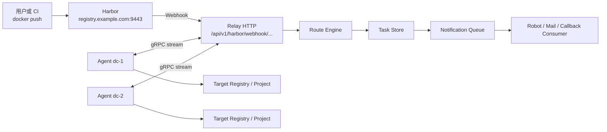

# 系统架构说明

`harbor-relay` 解决的是这样一个问题：

> 用户已经把镜像成功推到源 Harbor，如何把同一份镜像稳定、可观测、可审计地同步到一个或多个远端环境。

## 总体链路



## 关键组件职责

### Harbor

Harbor 负责：

- 接收用户 `docker push`
- 保存源项目中的镜像
- 在镜像推送后向 relay 发送 webhook

Harbor 不负责：

- 任务拆分
- 远端分发策略
- callback 和通知

### Relay

Relay 是控制面，负责：

- 接收 Harbor webhook
- 解析 `repository`、`tag`、`digest`
- 把 `repository` 路由到逻辑 `channel`
- 把 `channel` 展开到一个或多个 `site_name`
- 创建待同步任务
- 通过 gRPC 给 agent 派单
- 接收 agent 的进度和结果回报
- 发送 callback 和 notification

### Agent

Agent 是执行面，只做确定性的镜像搬运：

1. 登录源仓库
2. 按 `digest` 拉取镜像
3. 登录目标仓库
4. 给目标镜像打 tag
5. 推送到目标仓库
6. 回报进度和最终状态

Agent 不负责调度策略，也不负责接 webhook。

## 三个核心建模概念

### webhook path

`webhook path` 是入口边界，用来区分：

- 哪个 Harbor 项目或业务线在发事件
- 用哪个鉴权头
- 默认应该使用哪个 `source_registry`

例如：

```yaml
webhooks:
  - name: team-a
    path: /api/v1/harbor/webhook/team-a
```

### channel

`channel` 是 relay 内部的调度频道。

它不一定等于 Harbor 项目名，而是一个逻辑分组，可以代表：

- 一个业务线
- 一个交付客户
- 一组同步策略

例如：

```yaml
routes:
  - name: team-a
    channel: team-a
    repository_patterns:
      - "team-a/**"
```

### site_name

`site_name` 是远端站点标识，用来决定任务最终发给哪个站点。

例如：

```yaml
targets:
  - name: dc1
    site_name: dc1
```

只有当 agent 的 `site_name` 和任务匹配时，它才会消费该任务。

## 为什么按 digest 拉取

系统实际拉取的是：

```text
registry.example.com:9443/team-a/my-app@sha256:...
```

原因：

- `tag` 会变化
- `digest` 唯一且稳定
- 可以保证远端拿到的就是 Harbor webhook 对应的那一份镜像内容

同时，系统仍然保留更适合人看的描述符：

- `image:tag`
- `image:tag@sha256:...`

当前推荐实践是：

- 执行拉取：`image@sha256:...`
- 执行推送：`image:tag`
- 日志展示：`image:tag@sha256:...`

## callback 和 webhook 的区别

两者不要混淆：

- `webhook`
  - Harbor 发给 relay 的入站事件
  - 说明“源 Harbor 有新镜像推送了”
- `callback`
  - relay 在任务完成后发给外部系统的出站事件
  - 说明“镜像同步结果已经产生了”

## 对外入口规划建议

如果你已经用 Caddy 暴露 Harbor、relay 和文档站，推荐按域名分：

- `registry.example.com:9443`
  - Harbor
- `relay.example.com:9443`
  - relay，承接 webhook、状态接口和 gRPC
- `docs.example.com:9443`
  - 文档站

这样可以统一走一套外部 TLS 入口，同时按域名隔离不同服务。
